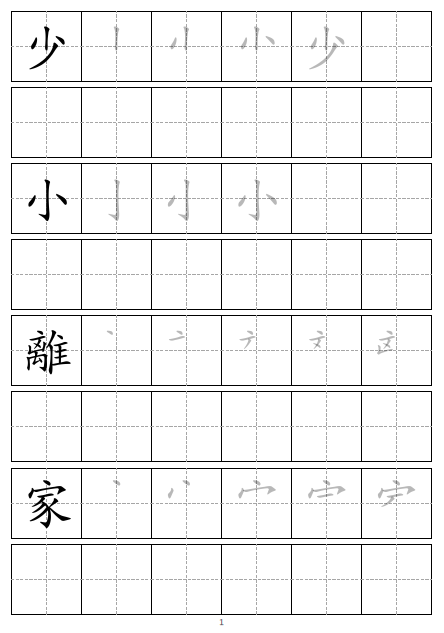

# 中文字練習字帖產生器

此儲存庫提供一支 R 腳本，用於產生可列印的中文手寫練習字帖 PDF。每一列由帶有中央輔助線的方格組成。第一個方格會根據筆畫資料顯示完整字形，後續方格則可依序顯示筆順描紅，剩餘方格保留為空白，供書寫練習使用。



# Chinese Character Practice Sheet Generator

This repository provides an R script that generates printable Chinese handwriting practice sheets as PDF files. Each row contains square cells with center guide lines. The first cell shows the complete character using stroke data, and the next cells can show incremental stroke-order tracing. Remaining cells are left blank for writing practice.


## Features

- Generate A4 PDF handwriting sheets
- Support portrait and landscape orientation
- Accept multiple input strings
- Paginate automatically across multiple pages
- Draw stroke-order tracing from vector stroke data
- Use installed CJK fonts for text rendering
- Add page numbers to the output PDF

## Files

- `practice_sheet_generator.R`: main script
- `README.md`: usage notes
- `data/graphics.txt`: stroke data file from the Make Me a Hanzi project (not included by default unless you add it)

## Requirements

R packages:

```r
install.packages(c("grid", "systemfonts", "jsonlite", "magick"))
```

System requirements:

- A CJK-capable font installed on the system, for example `Microsoft JhengHei`, `PingFang TC`, or `Noto Sans CJK`
- ImageMagick support as required by the `magick` package
- A stroke data file such as `graphics.txt`

## Stroke data source

The script expects a JSONL file containing at least the fields `character` and `strokes`. A suitable source is the `graphics.txt` file from Make Me a Hanzi:

GitHub project: skishore/makemeahanzi

Add the file to:

```text
data/graphics.txt
```

## Output layout

For each character row:

- Cell 1: full traced character based on all strokes
- Following trace cells: progressive stroke build-up
- Remaining cells: blank practice boxes

Additional blank rows can be inserted under each character row with `rows_per_character`.

## Main function

```r
generate_practice_sheet(
  texts,
  output_file = "practice_sheet.pdf",
  stroke_data_file = "data/graphics.txt",
  page_size = "A4",
  page_orientation = "portrait",
  rows_per_character = 2,
  cols = 8,
  trace_cols = 4,
  cell_size = 56,
  row_gap = 8,
  top_margin = 18,
  bottom_margin = 18,
  font_family = NULL,
  bg = "white",
  trace_alpha = 0.28,
  first_cell_alpha = 1
)
```

## Argument summary

- `texts`: character vector of strings to print
- `output_file`: name of the PDF file to create
- `stroke_data_file`: path to the JSONL stroke database
- `page_size`: currently only `"A4"` is implemented
- `page_orientation`: `"portrait"` or `"landscape"`
- `rows_per_character`: number of rows allocated to each character
- `cols`: number of cells in each row
- `trace_cols`: number of incremental trace cells after the first cell
- `cell_size`: box size in points
- `row_gap`: vertical gap between rows in points
- `top_margin`, `bottom_margin`: page margins in points
- `font_family`: font family to use; if `NULL`, the script selects the first available preferred CJK font
- `bg`: background colour of the PDF page
- `trace_alpha`: opacity of incremental tracing examples
- `first_cell_alpha`: opacity of the first, complete traced character

## Example

```r
source("practice_sheet_generator.R")

generate_practice_sheet(
  texts = c(
    "少小離家老大回",
    "鄉音無改鬢毛催",
    "兒童相見不相識",
    "笑問客從何處來"
  ),
  output_file = "traditional_chinese_practice_A4.pdf",
  stroke_data_file = "data/graphics.txt",
  page_size = "A4",
  page_orientation = "portrait",
  rows_per_character = 2,
  cols = 6,
  trace_cols = 5,
  cell_size = 92,
  font_family = "Microsoft JhengHei"
)
```

## Notes

1. The script uses `cairo_pdf()` to create the PDF.
2. The tracing graphics are rasterised from SVG paths using `magick::image_read_svg()`.
3. If a requested character is not found in the stroke database, the row will still be drawn, but tracing content will be absent.
4. Automatic font selection is best-effort only. On systems without a suitable CJK font, text rendering may fail or display missing glyphs.
5. Only A4 output is implemented in the current version.

## Suggested repository structure

```text
.
├── practice_sheet_generator.R
├── README.md
└── data/
    └── graphics.txt
```

## Limitations

- The script does not currently support paper sizes other than A4.
- The first example cell is drawn from stroke data rather than from a font glyph.
- Stroke rendering depends on the external JSONL dataset and the SVG rasterisation path.
- The script is designed for printable worksheets, not for interactive stroke animation.

